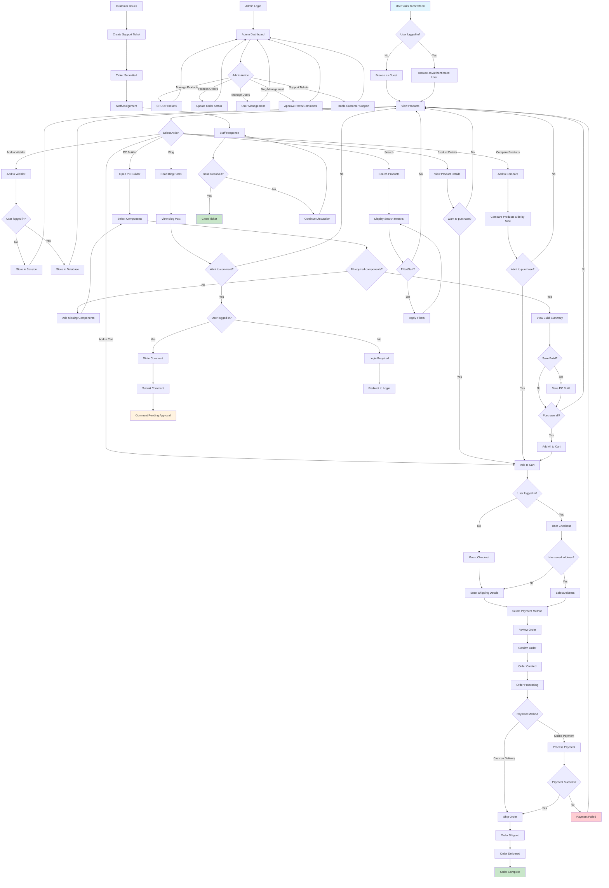

# Activity Diagram - TechReform E-commerce System

## Activity Flow Description

### Customer Journey

1. **Product Discovery**: Users browse products, search, and filter
2. **Product Evaluation**: View details, compare products, read reviews
3. **Cart Management**: Add items, modify quantities, apply coupons
4. **Checkout Process**: Enter shipping details, select payment method
5. **Order Tracking**: Monitor order status from processing to delivery

### PC Builder Workflow

1. **Component Selection**: Choose CPU, GPU, RAM, etc.
2. **Compatibility Check**: Ensure components work together
3. **Build Validation**: Check power requirements and completeness
4. **Save/Purchase**: Save build or add all components to cart

### Blog Interaction

1. **Content Consumption**: Read blog posts and articles
2. **User Engagement**: Comment on posts (requires login)
3. **Content Moderation**: Admin approval for comments

### Admin Operations

1. **Product Management**: Add, edit, delete products
2. **Order Processing**: Update order status and tracking
3. **User Management**: Handle user accounts and permissions
4. **Content Moderation**: Approve blog posts and comments
5. **Customer Support**: Respond to support tickets

### Support System

1. **Ticket Creation**: Customer submits support request
2. **Ticket Assignment**: Staff member assigned to ticket
3. **Resolution Process**: Back-and-forth communication until resolved
4. **Ticket Closure**: Mark ticket as resolved when issue is fixed
