# Data Flow Diagram - TechReform E-commerce System

## Level 0 - Context Diagram

```mermaid
flowchart TD
    %% External Entities
    Customer[👤 Customer]
    Admin[👤 Admin]
    Staff[👤 Staff Member]
    PaymentGateway[💳 Payment Gateway]
    EmailService[📧 Email Service]

    %% Main System
    TechReform[(🏪 TechReform E-commerce System)]

    %% Data Flows
    Customer -->|Product searches, Orders, Reviews| TechReform
    TechReform -->|Product catalogs, Order status, Recommendations| Customer

    Admin -->|Product management, User management, Reports| TechReform
    TechReform -->|Analytics, System status, User data| Admin

    Staff -->|Order processing, Support responses| TechReform
    TechReform -->|Order details, Customer tickets| Staff

    TechReform -->|Payment requests| PaymentGateway
    PaymentGateway -->|Payment confirmations| TechReform

    TechReform -->|Order confirmations, Notifications| EmailService
    EmailService -->|Delivery status| TechReform
```

## Level 1 - System Overview

```mermaid
flowchart TD
    %% External Entities
    Customer[👤 Customer]
    Admin[👤 Admin]
    Staff[👤 Staff]
    PaymentGateway[💳 Payment Gateway]

    %% Level 1 Processes
    P1[1.0<br/>User Management]
    P2[2.0<br/>Product Catalog]
    P3[3.0<br/>Shopping Cart]
    P4[4.0<br/>Order Processing]
    P5[5.0<br/>Blog System]
    P6[6.0<br/>PC Builder]
    P7[7.0<br/>Support System]

    %% Data Stores
    D1[(D1: Users)]
    D2[(D2: Products)]
    D3[(D3: Orders)]
    D4[(D4: Blog)]
    D5[(D5: Support)]

    %% Data Flows
    Customer -->|Registration, Login| P1
    P1 -->|User credentials| D1
    D1 -->|User profile| P1
    P1 -->|Authentication status| Customer

    Customer -->|Product search, Browse| P2
    P2 -->|Product queries| D2
    D2 -->|Product data| P2
    P2 -->|Product listings| Customer

    Customer -->|Add to cart, Update cart| P3
    P3 -->|Cart data| Customer

    Customer -->|Checkout, Payment| P4
    P4 -->|Order data| D3
    P4 -->|Payment request| PaymentGateway
    PaymentGateway -->|Payment status| P4
    P4 -->|Order confirmation| Customer

    Customer -->|Read posts, Comments| P5
    P5 -->|Blog queries| D4
    D4 -->|Blog content| P5
    P5 -->|Blog pages| Customer

    Customer -->|Build PC, Save config| P6
    P6 -->|Product queries| D2
    P6 -->|PC configurations| Customer

    Customer -->|Support requests| P7
    P7 -->|Ticket data| D5
    P7 -->|Ticket status| Customer

    Admin -->|Manage products, users| P2
    Admin -->|Process orders| P4
    Admin -->|Manage blog| P5
    Staff -->|Handle tickets| P7
```

## Level 2 - Product Catalog System

## Level 2 - Order Processing System

```mermaid
flowchart TD
    %% External Entities
    Customer[👤 Customer]
    Admin[👤 Admin]
    PaymentGateway[💳 Payment Gateway]

    %% Level 2 Processes
    P41[4.1<br/>Create Order]
    P42[4.2<br/>Process Payment]
    P43[4.3<br/>Update Order Status]
    P44[4.4<br/>Generate Invoice]
    P45[4.5<br/>Track Shipment]

    %% Data Stores
    D3[(D3: Orders)]
    D31[(D3.1: Order Items)]
    D32[(D3.2: Shipping)]
    D33[(D3.3: Payments)]
    D2[(D2: Products)]

    %% Data Flows
    Customer -->|Cart data, Shipping info| P41
    P41 -->|Product availability| D2
    P41 -->|Order creation| D3
    P41 -->|Order items| D31
    P41 -->|Shipping details| D32
    D2 -->|Stock verification| P41
    P41 -->|Order confirmation| Customer

    Customer -->|Payment info| P42
    P42 -->|Payment request| PaymentGateway
    PaymentGateway -->|Payment response| P42
    P42 -->|Payment record| D33
    P42 -->|Payment status| P41
    P42 -->|Receipt| Customer

    Admin -->|Status update| P43
    P43 -->|Order updates| D3
    P43 -->|Shipping updates| D32
    D3 -->|Current status| P43
    P43 -->|Status notification| Customer

    P41 -->|Order data| P44
    P44 -->|Invoice data| D3
    P44 -->|Invoice| Customer

    Customer -->|Tracking request| P45
    P45 -->|Shipping query| D32
    D32 -->|Tracking info| P45
    P45 -->|Tracking details| Customer
```

## Level 2 - PC Builder System

## Level 2 - Blog System

```mermaid
flowchart TD
    %% External Entities
    Customer[👤 Customer]
    Blogger[👤 Blogger]
    Admin[👤 Admin]

    %% Level 2 Processes
    P51[5.1<br/>Create Blog Post]
    P52[5.2<br/>Moderate Content]
    P53[5.3<br/>Display Posts]
    P54[5.4<br/>Manage Comments]
    P55[5.5<br/>Track Views]

    %% Data Stores
    D4[(D4: Blog Posts)]
    D41[(D4.1: Categories)]
    D42[(D4.2: Tags)]
    D43[(D4.3: Comments)]
    D44[(D4.4: Analytics)]

    %% Data Flows
    Blogger -->|Post content| P51
    P51 -->|Post data| D4
    P51 -->|Category assignment| D41
    P51 -->|Tag assignment| D42
    P51 -->|Draft created| Blogger

    Admin -->|Moderation action| P52
    P52 -->|Post status update| D4
    D4 -->|Pending posts| P52
    P52 -->|Approval status| Blogger

    Customer -->|Browse request| P53
    P53 -->|Post queries| D4
    P53 -->|Category queries| D41
    P53 -->|Tag queries| D42
    D4 -->|Published posts| P53
    D41 -->|Category data| P53
    D42 -->|Tag data| P53
    P53 -->|Blog pages| Customer

    Customer -->|Comment submission| P54
    P54 -->|Comment data| D43
    Admin -->|Comment moderation| P54
    P54 -->|Approved comments| P53

    Customer -->|Page view| P55
    P55 -->|View count update| D44
    P55 -->|Analytics data| D44
```

## Level 2 - Support System

```mermaid
flowchart TD
    %% External Entities
    Customer[👤 Customer]
    Staff[👤 Staff]
    Admin[👤 Admin]

    %% Level 2 Processes
    P71[7.1<br/>Create Ticket]
    P72[7.2<br/>Assign Ticket]
    P73[7.3<br/>Respond to Ticket]
    P74[7.4<br/>Track Resolution]
    P75[7.5<br/>Generate Reports]

    %% Data Stores
    D5[(D5: Support Tickets)]
    D51[(D5.1: Categories)]
    D52[(D5.2: Responses)]
    D53[(D5.3: Staff Assignments)]

    %% Data Flows
    Customer -->|Support request| P71
    P71 -->|Ticket data| D5
    P71 -->|Category assignment| D51
    P71 -->|Ticket created| Customer

    Admin -->|Assignment rules| P72
    P72 -->|Staff assignment| D53
    P72 -->|Ticket update| D5
    D5 -->|New tickets| P72
    P72 -->|Assignment notification| Staff

    Staff -->|Response content| P73
    Customer -->|Customer reply| P73
    P73 -->|Response data| D52
    P73 -->|Ticket update| D5
    P73 -->|Response notification| Customer
    P73 -->|Response notification| Staff

    Staff -->|Resolution status| P74
    P74 -->|Status update| D5
    P74 -->|Resolution notification| Customer

    Admin -->|Report request| P75
    P75 -->|Ticket analytics| D5
    P75 -->|Response analytics| D52
    D5 -->|Ticket data| P75
    D52 -->|Response data| P75
    P75 -->|Support reports| Admin
```

## Data Flow Patterns

### Real-time Data Flows

- Shopping cart updates (session-based)
- Product availability checks
- Order status notifications
- Support ticket responses

### Batch Data Flows

- Inventory updates
- Analytics generation
- Email notifications
- Report generation

### Security Data Flows

- User authentication
- Payment processing
- Admin privilege checks
- Session management

### Integration Data Flows

- Payment gateway communication
- Email service integration
- Search indexing
- Cache management

## Key Data Transformations

1. **Product Search**: Raw queries → Filtered results → Formatted listings
2. **Order Processing**: Cart items → Order items → Invoice data
3. **PC Builder**: Component selection → Compatibility check → Build summary
4. **Blog System**: Raw content → Moderated content → Published posts
5. **Support System**: Customer issues → Structured tickets → Resolution tracking
