# Entity Relationship Diagram - TechReform E-commerce System

```mermaid
erDiagram
    User ||--o{ UserProfile : has
    User ||--o{ Cart : owns
    User ||--o{ Order : places
    User ||--o{ BlogPost : creates
    User ||--o{ Comment : writes
    User ||--o{ WishList : has
    User ||--o{ PCBuilder : creates
    User ||--o{ SupportTicket : submits    UserProfile {
        id UUID PK
        user_id UUID FK
        role VARCHAR
        phone VARCHAR
        address TEXT
        profile_image ImageField
        is_verified BOOLEAN
        created_at DATETIME
        updated_at DATETIME
    }

    Cart ||--o{ CartItem : contains    Cart {
        id UUID PK
        user_id UUID FK
        session_id VARCHAR
        created_at DATETIME
        updated_at DATETIME
    }

    CartItem }o--|| BaseProduct : references
    CartItem {
        id UUID PK
        cart_id UUID FK
        product_id UUID
        product_category VARCHAR
        quantity INTEGER
        price DECIMAL
        created_at DATETIME
        updated_at DATETIME
    }

    Order ||--o{ OrderItem : contains
    Order ||--|| ShippingAddress : has
    Order {
        id UUID PK
        user_id UUID FK
        order_number VARCHAR
        status VARCHAR
        payment_method VARCHAR
        payment_status VARCHAR
        tax DECIMAL
        shipping_cost DECIMAL
        total_price DECIMAL
        notes TEXT
        ip_address VARCHAR
        created_at DATETIME
        updated_at DATETIME
        payment_date DATETIME
        shipped_date DATETIME
        delivered_date DATETIME
    }

    OrderItem }o--|| BaseProduct : references
    OrderItem {
        id UUID PK
        order_id UUID FK
        product_id UUID
        product_category VARCHAR
        product_name VARCHAR
        quantity INTEGER
        price DECIMAL
        created_at DATETIME
    }

    ShippingAddress {
        id UUID PK
        order_id UUID FK
        user_id UUID FK
        full_name VARCHAR
        phone VARCHAR
        email EMAIL
        address_line1 VARCHAR
        address_line2 VARCHAR
        city VARCHAR
        state VARCHAR
        postal_code VARCHAR
        created_at DATETIME
        updated_at DATETIME
    }

    Category ||--o{ BlogPost : categorizes
    Category {
        id INTEGER PK
        name VARCHAR
        slug SLUG
        description TEXT
        created_at DATETIME
        updated_at DATETIME
    }

    Tag }o--o{ BlogPost : tags
    Tag {
        id INTEGER PK
        name VARCHAR
        slug SLUG
    }

    BlogPost ||--o{ Comment : has    BlogPost {
        id INTEGER PK
        title VARCHAR
        slug SLUG
        author_id UUID FK
        category_id INTEGER FK
        featured_image ImageField
        summary TEXT
        content RichText
        status VARCHAR
        is_featured BOOLEAN
        view_count INTEGER
        created_at DATETIME
        updated_at DATETIME
        published_at DATETIME
    }

    Comment {
        id INTEGER PK
        post_id INTEGER FK
        author_id UUID FK
        content TEXT
        is_approved BOOLEAN
        created_at DATETIME
        updated_at DATETIME
    }

    WishList ||--o{ WishlistItem : contains
    WishList {
        id UUID PK
        user_id UUID FK
        session_id VARCHAR
        created_at DATETIME
        updated_at DATETIME
    }

    WishlistItem }o--|| BaseProduct : references
    WishlistItem {
        id INTEGER PK
        wishlist_id UUID FK
        session_key VARCHAR
        user_id UUID FK
        product_id VARCHAR
        category VARCHAR
        date_added DATETIME
    }

    CompareList ||--o{ CompareItem : contains
    CompareList {
        id UUID PK
        user_id UUID FK
        session_id VARCHAR
        created_at DATETIME
        updated_at DATETIME
    }

    CompareItem }o--|| BaseProduct : references
    CompareItem {
        id UUID PK
        compare_list_id UUID FK
        product_id VARCHAR
        category VARCHAR
        date_added DATETIME
    }

    PCBuilder ||--o{ PCBuilderItem : contains
    PCBuilder {
        id UUID PK
        user_id UUID FK
        name VARCHAR
        is_public BOOLEAN
        created_at DATETIME
        updated_at DATETIME
        session_id VARCHAR
    }

    PCBuilderItem }o--|| BaseProduct : references
    PCBuilderItem {
        id UUID PK
        pc_builder_id UUID FK
        component_type VARCHAR
        product_id UUID
        product_name VARCHAR
        product_price DECIMAL
        product_tdp INTEGER
    }

    BaseProduct {
        id UUID PK
        name VARCHAR
        price DECIMAL
        regular_price DECIMAL
        brand VARCHAR
        model VARCHAR
        warranty VARCHAR
        description TEXT
        category VARCHAR
        tdp INTEGER
        created_at DATETIME
        updated_at DATETIME
        is_featured BOOLEAN
        is_new_arrival BOOLEAN
        is_on_sale BOOLEAN
        stock INTEGER
        is_available BOOLEAN
    }

    CPU ||--|| BaseProduct : inherits
    GPU ||--|| BaseProduct : inherits
    RAM ||--|| BaseProduct : inherits
    SSD ||--|| BaseProduct : inherits
    HDD ||--|| BaseProduct : inherits
    Motherboard ||--|| BaseProduct : inherits
    PowerSupply ||--|| BaseProduct : inherits
    Casing ||--|| BaseProduct : inherits
    Cooler ||--|| BaseProduct : inherits
    Monitor ||--|| BaseProduct : inherits
    Keyboard ||--|| BaseProduct : inherits
    Mouse ||--|| BaseProduct : inherits
    Headphone ||--|| BaseProduct : inherits

    CPU {
        socket VARCHAR
        cores INTEGER
        threads INTEGER
        base_frequency FLOAT
        boost_frequency FLOAT
        cache VARCHAR
        integrated_graphics BOOLEAN
        image1 ImageField
        image2 ImageField
        image3 ImageField
        image4 ImageField
        image5 ImageField
    }

    GPU {
        gpu_series VARCHAR
        memory_capacity VARCHAR
        memory_type VARCHAR
        core_clock INTEGER
        boost_clock INTEGER
        memory_clock INTEGER
        interface VARCHAR
        hdmi_ports VARCHAR
        displayport VARCHAR
        dvi_ports VARCHAR
        connectors VARCHAR
        image1 ImageField
        image2 ImageField
        image3 ImageField
        image4 ImageField
        image5 ImageField
    }

    SupportCategory ||--o{ SupportTicket : categorizes
    SupportCategory {
        id INTEGER PK
        name VARCHAR
        description TEXT
        is_active BOOLEAN
        created_at DATETIME
        updated_at DATETIME
    }

    SupportTicket ||--o{ SupportResponse : has    SupportTicket {
        id INTEGER PK
        ticket_id VARCHAR
        customer_id UUID FK
        subject VARCHAR
        category_id INTEGER FK
        description TEXT
        customer_email EMAIL
        customer_phone VARCHAR
        status VARCHAR
        priority VARCHAR
        assigned_staff_id UUID FK
        created_at DATETIME
        updated_at DATETIME
        resolved_at DATETIME
    }

    SupportResponse {
        id INTEGER PK
        ticket_id INTEGER FK
        author_id UUID FK
        message TEXT
        is_staff_response BOOLEAN
        created_at DATETIME
        updated_at DATETIME
    }
```

## Key Relationships

1. **User Management**: User has one-to-one relationship with UserProfile for extended information
2. **Product Catalog**: BaseProduct serves as abstract base for all product types (CPU, GPU, etc.)
3. **Shopping Cart**: Users can have carts with multiple cart items referencing products
4. **Order Processing**: Orders contain order items and have shipping addresses
5. **Blog System**: Users create blog posts with categories, tags, and comments
6. **Wishlist & Compare**: Users can save products for later and compare them
7. **PC Builder**: Users can create PC builds with multiple components
8. **Support System**: Users can submit support tickets with responses

## Database Design Notes

- UUID primary keys used for security and scalability
- Polymorphic relationships for product references
- Session-based support for anonymous users
- Comprehensive audit trails with timestamps
- Role-based access control through UserProfile
- Multi-image support for products
- Rich text content support for blogs
