# Gantt Chart - TechReform BD v2 Development Timeline

## Project Overview

**Duration:** 8 Weeks (56 Days)
**Team Size:** 3 Developers
**Start Date:** Week 1
**End Date:** Week 8

### Team Members

- **Sharif** - Frontend Developer (React/Django Templates, JavaScript, CSS/Tailwind)
- **Priom** - Backend Developer (Django, Python, Database, APIs)
- **Shorna** - UI/UX Designer (Design Systems, User Experience, Prototyping)

## Development Gantt Chart

## Weekly Breakdown by Developer

### Week 1-2: Foundation Phase

| Developer | Tasks | Duration |
|-----------|-------|----------|
| **Priom** | Django project setup, database models, user authentication | 10 days |
| **Shorna** | Design system creation, wireframes, user research | 14 days |
| **Sharif** | Development environment, base templates, CSS framework | 8 days |

### Week 3-4: Core Development

| Developer | Tasks | Duration |
|-----------|-------|----------|
| **Priom** | Product models, API endpoints, cart system | 15 days |
| **Shorna** | Product catalog design, UI components, user flows | 12 days |
| **Sharif** | Authentication UI, product listing templates | 14 days |

### Week 5-6: Feature Implementation

| Developer | Tasks | Duration |
|-----------|-------|----------|
| **Priom** | Order processing, PC builder backend, blog system | 16 days |
| **Shorna** | Shopping cart design, PC builder UI, mobile design | 15 days |
| **Sharif** | Shopping cart frontend, user dashboard, search functionality | 16 days |

### Week 7-8: Integration & Launch

| Developer | Tasks | Duration |
|-----------|-------|----------|
| **Priom** | API integration, payment gateway, security testing | 12 days |
| **Shorna** | Final UI polish, accessibility, user testing | 10 days |
| **Sharif** | Frontend integration, optimization, deployment prep | 12 days |

## Key Milestones

## Resource Allocation

### Priom (Backend Developer)

- **Focus Areas:** Django development, database design, API creation, server-side logic
- **Key Deliverables:**
  - User authentication & authorization system
  - Product catalog backend with all models (CPU, GPU, RAM, etc.)
  - Shopping cart and order processing system
  - PC Builder configuration engine
  - Blog system with CKEditor integration
  - Customer support ticket system
  - Payment gateway integration
  - RESTful API endpoints

### Sharif (Frontend Developer)

- **Focus Areas:** User interface development, JavaScript functionality, responsive design
- **Key Deliverables:**
  - Responsive HTML templates using Django templating
  - Interactive JavaScript features (cart, search, filters)
  - Tailwind CSS styling and component library
  - Product comparison interface
  - PC Builder drag-and-drop interface
  - AJAX integration for dynamic content
  - Cross-browser compatibility
  - Performance optimization

### Shorna (UI/UX Designer)

- **Focus Areas:** User experience design, visual design, usability testing
- **Key Deliverables:**
  - Complete design system and style guide
  - User journey mapping and wireframes
  - High-fidelity mockups for all pages
  - Mobile-first responsive design
  - Accessibility compliance (WCAG 2.1)
  - User testing and feedback incorporation
  - Design handoff documentation
  - Brand consistency guidelines

## Technical Stack Integration Timeline

```mermaid
gantt
    title 🛠️ Technology Stack Implementation Timeline
    dateFormat YYYY-MM-DD
    axisFormat %m/%d

    %% Backend Infrastructure
    section 🔧 Backend Technologies
    Django Framework Setup              :done, tech1, 2024-01-01, 5d
    SQLite Database Configuration       :done, tech2, 2024-01-04, 4d
    Django Apps Architecture           :active, tech3, 2024-01-06, 7d
    Django Admin Customization         :tech4, 2024-01-11, 6d
    RESTful API Development            :tech5, 2024-01-16, 12d

    %% Frontend Development
    section 💻 Frontend Technologies
    Tailwind CSS Integration           :tech6, 2024-01-08, 8d
    JavaScript ES6+ Features           :tech7, 2024-01-13, 10d
    Django Template System             :tech8, 2024-01-15, 12d
    AJAX & Fetch API Integration       :tech9, 2024-01-23, 8d
    Browser Compatibility Testing      :tech10, 2024-02-05, 6d

    %% External Services
    section 🔗 Third-party Integrations
    CKEditor Rich Text Editor          :tech11, 2024-01-26, 5d
    Image Upload & Processing          :tech12, 2024-01-29, 6d
    Email Service Integration          :tech13, 2024-02-02, 5d
    Payment Gateway Setup              :tech14, 2024-02-08, 8d
    SEO & Meta Tags Implementation     :tech15, 2024-02-16, 5d

    %% Quality Assurance
    section 🧪 Testing & Quality
    Unit Testing Framework             :testing1, 2024-01-20, 8d
    Integration Testing Suite          :testing2, 2024-02-01, 6d
    Performance Testing                :testing3, 2024-02-10, 5d
    Security Vulnerability Scan        :testing4, 2024-02-15, 4d

    %% Technology Milestones
    section 📋 Tech Milestones
    Backend Foundation Ready           :milestone, tm1, 2024-01-17, 0d
    Frontend Core Complete             :milestone, tm2, 2024-02-02, 0d
    All Integrations Working           :milestone, tm3, 2024-02-16, 0d
    Tech Stack Fully Deployed         :milestone, tm4, 2024-02-21, 0d
```

### Technology Stack Details

| **Category** | **Technology** | **Purpose** | **Implementation Week** |
|--------------|----------------|-------------|-------------------------|
| **Backend** | Django 4.2+ | Web framework & admin panel | Week 1 |
| **Database** | SQLite | Development database | Week 1 |
| **Frontend** | Tailwind CSS | Utility-first styling | Week 2 |
| **Scripting** | JavaScript ES6+ | Interactive functionality | Week 2-3 |
| **Templates** | Django Templates | Server-side rendering | Week 2-4 |
| **Rich Text** | CKEditor | Blog content editing | Week 4 |
| **Media** | Pillow | Image processing | Week 4 |
| **Email** | Django Email Backend | Notifications & alerts | Week 5 |
| **Payments** | Payment Gateway API | Transaction processing | Week 6 |
| **SEO** | Django SEO Framework | Search optimization | Week 7 |

### Integration Dependencies

## Risk Management & Contingency

### High-Risk Items

1. **PC Builder Complexity** - Complex component compatibility logic
2. **Payment Integration** - Third-party service dependencies
3. **Performance** - Large product catalog optimization
4. **Mobile Responsiveness** - Cross-device compatibility

### Mitigation Strategies

- **Buffer Time:** 10% buffer built into each phase
- **Daily Standups:** Quick sync meetings for issue resolution
- **Code Reviews:** Peer review process for quality assurance
- **Testing Integration:** Continuous testing throughout development
- **Backup Plans:** Alternative solutions for high-risk components

## Success Metrics

### Technical Metrics

- ✅ All Django apps functional and integrated
- ✅ 100% responsive design across devices
- ✅ Page load times under 3 seconds
- ✅ Zero critical security vulnerabilities
- ✅ 95%+ uptime during testing phase

### Business Metrics

- ✅ Complete product catalog (13+ component categories)
- ✅ Functional PC builder with compatibility checking
- ✅ Integrated shopping cart and checkout process
- ✅ User authentication and role-based permissions
- ✅ Customer support ticket system operational

---

*This Gantt chart represents the comprehensive 8-week development timeline for TechReform BD v2, based on the actual codebase structure and feature requirements identified in the project.*
