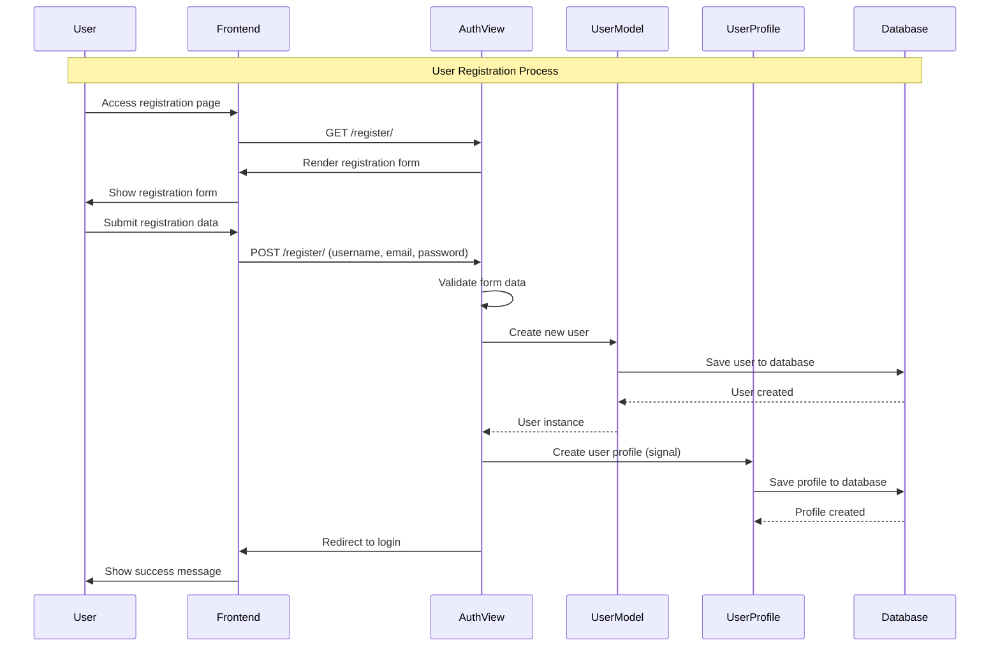
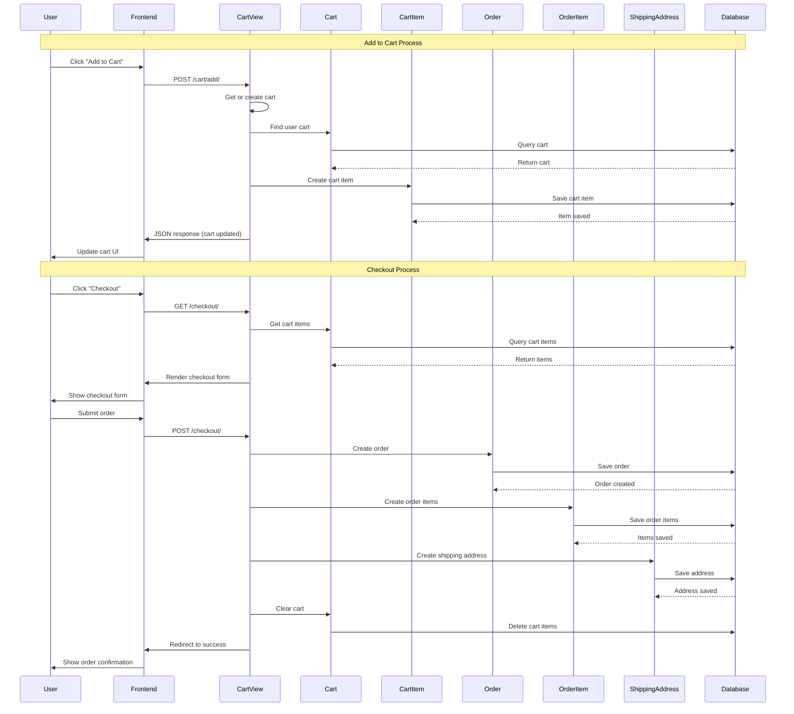
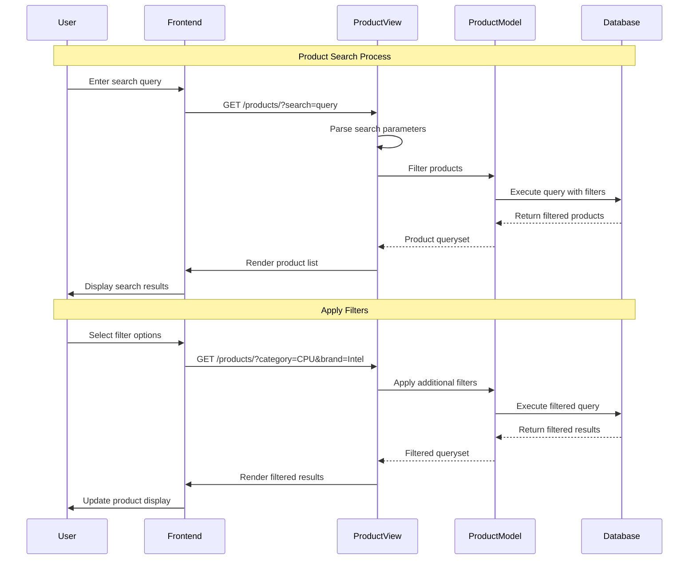
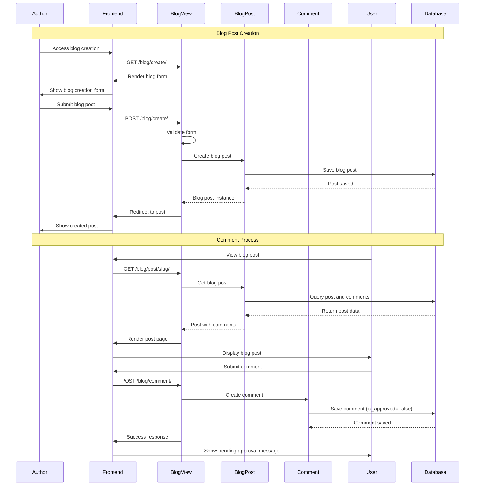
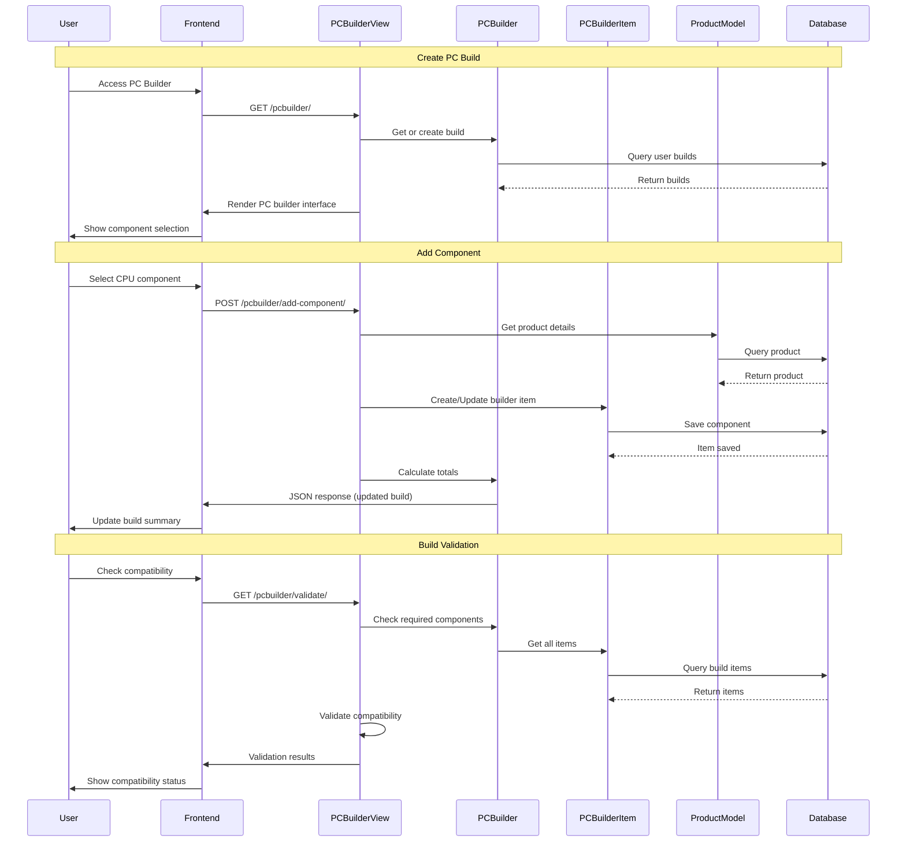
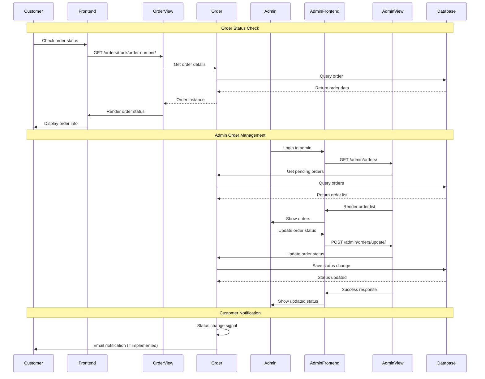
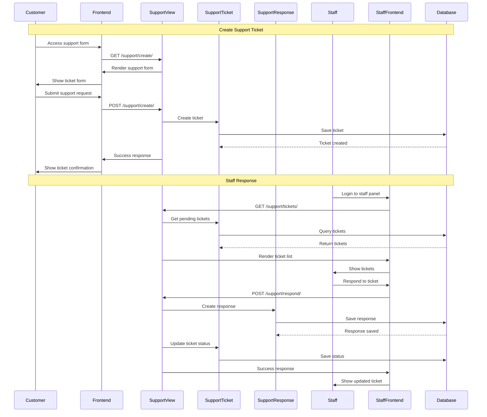

# Sequence Diagram - TechReform E-commerce System

## 1. User Registration and Login Sequence

## 2. Shopping Cart and Checkout Sequence

## 3. Product Search and Filter Sequence

## 4. Blog Post Creation and Comment Sequence

## 5. PC Builder Configuration Sequence

## 6. Order Processing and Status Update Sequence

## 7. Support Ticket Management Sequence

## Key Sequence Patterns

### Authentication Flow

- User registration automatically creates profile via Django signals
- Login validation and session management
- Role-based access control for different user types

### E-commerce Flow

- Session-based cart for anonymous users
- Database-persistent cart for authenticated users
- Order creation with item copying and address management

### Content Management

- Blog post creation with approval workflow
- Comment moderation system
- Rich text content handling

### Product Management

- Dynamic product filtering and search
- Category-based product organization
- Inventory tracking and availability

### Admin Operations

- Centralized admin interface for all models
- Bulk operations and status updates
- Audit trail for administrative actions
